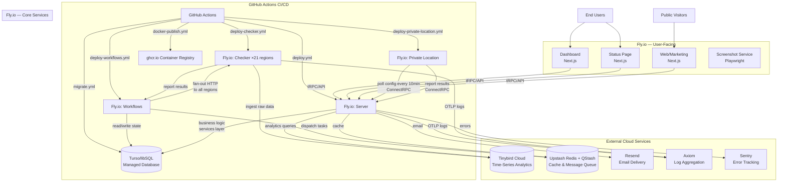
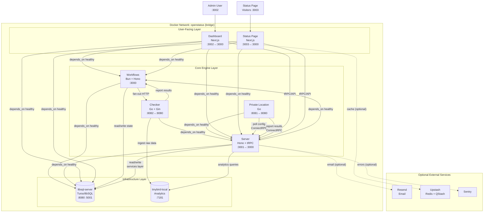

# OpenStatus Architecture

## Overview

OpenStatus is an open-source synthetic monitoring platform. It periodically checks websites, APIs, TCP endpoints, and DNS records from ~21 globally distributed regions, records response data, detects incidents, and notifies teams across 14+ channels. It also provides public-facing status pages for end-user transparency.

- **Monorepo:** pnpm workspaces + Turborepo
- **Deployment:** Fly.io (cloud) | Docker Compose / Coolify (self-hosted)
- **CI/CD:** GitHub Actions
- **Database:** Turso/libSQL (Drizzle ORM) for transactional data, Tinybird for analytics
- **Languages:** TypeScript (apps + packages), Go (checker, private-location)

---

## Deployment Architecture Diagrams

### Cloud Deployment (Fly.io — Production)



### Self-Hosted Deployment (Docker Compose / Coolify)



---

## Self-Hosted Architecture

> **Updated 2026-06-30:** The full deployment now includes 11 services with Redis,
> checker, and private-probe. See the comprehensive reference:
> **[self-hosted-docker-architecture.md](self-hosted-docker-architecture.md)**

### Three Deployment Variants

OpenStatus provides three Docker Compose files for self-hosted deployments, ranging from minimal to full-featured:

| Variant | File | Services | Image Source | Startup Order |
|---------|------|----------|--------------|---------------|
| **Full (build from source)** | `docker-compose.yaml` | 11 | Local `docker build` | libsql → redis → redis-http + tinybird → workflows → server → checker → private-location → private-probe → dashboard → status-page |
| **GitHub Packages (pre-built)** | `docker-compose.github-packages.yaml` | 9 | `ghcr.io/openstatushq/*` | libsql → tinybird → workflows → server → checker+private-location → dashboard → status-page |
| **Lightweight (minimal)** | `docker-compose-lightweight.yaml` | 4 | Build + `oven/bun` | libsql → db-migrate → dashboard → status-page |

### Service Details (Full Deployment)

#### Infrastructure Layer (always present)

| Service | Image | Internal Port | Exposed Port | Health Check | Purpose |
|---------|-------|---------------|--------------|--------------|---------|
| `libsql` | `ghcr.io/tursodatabase/libsql-server:latest` | 8080, 5001 | 8080, 5001 | TCP connect to :8080 | Primary transactional database. Single-node primary (`SQLD_NODE=primary`). |
| `tinybird-local` | `tinybirdco/tinybird-local:latest` | 7181, 8123 | 7181 | `curl :7181/` | Local analytics engine. Replaces Tinybird Cloud. `COMPATIBILITY_MODE=1`. **amd64 only** (no ARM support). Requires init: `scripts/tinybird-self-hosted-init.sh`. |
| `db-migrate` † | `oven/bun:1.3.6` | — | — | One-shot | Runs `bun install && bun run migrate` then exits. Depends on libsql healthy. |

† Lightweight variant only. Full variants expect pre-migrated DB or manual migration.

#### Core Engine Layer

| Service | Port Map | Health Check | Startup Deps | Purpose |
|---------|----------|--------------|--------------|---------|
| `workflows` | `3000:3000` | `curl :3000/ping` | libsql (healthy) | Cron orchestrator. Polls DB for monitors, dispatches checks to checker, processes results, creates incidents, sends notifications. Writes to `workflows-data` volume. |
| `server` | `3001:3000` | `curl :3000/ping` | workflows (healthy) + libsql (healthy) | Backend API. Serves REST, tRPC, ConnectRPC, Slack, MCP. The services layer lives here. |
| `checker` ‡ | `8082:8080` | `curl :8080/health` | server (healthy) | HTTP/TCP/DNS/Ping probe executor. Self-hosted single-region equivalent of the Fly.io multi-region fleet. |
| `private-location` | `8081:8080` | `wget :8080/health` | server (healthy) | On-prem probe agent. Polls server for monitor configs every 10 minutes, runs checks locally, reports back via ConnectRPC. |

‡ GitHub Packages variant only. Full build-from-source variant lacks a standalone checker container.

#### User-Facing Layer

| Service | Port Map | Health Check | Startup Deps | Purpose |
|---------|----------|--------------|--------------|---------|
| `dashboard` | `3002:3000` | `curl :3000/` | workflows + libsql + server (all healthy) | Admin UI. `AUTH_TRUST_HOST=true` for self-hosted auth. `SELF_HOST=true` enables magic-link login. |
| `status-page` | `3003:3000` | `curl :3000/` | workflows + libsql + server (all healthy) | Public status pages. Same auth config as dashboard. |

### Startup Dependency Order

```
libsql ──(healthy)──▶ workflows ──(healthy)──▶ server ──(healthy)──▶ private-location
    │                      │                        │                      │
    │                      │                        ├──(healthy)──▶ checker
    │                      │                        │
    └──────────────────────┼────────────────────────┤
                           │                        │
                    dashboard ◀──(healthy)──────────┘
                    status-page ◀──(healthy)────────┘
```

The dashboard and status-page wait for all three of workflows, libsql, and server to be healthy before starting.

### Network Architecture

All services communicate over a single Docker bridge network named `openstatus`:

```
DATABASE_URL=http://libsql:8080          ← all TypeScript services
DB_URL=http://libsql:8080                ← Go services (private-location, checker)
TINYBIRD_URL=http://tinybird-local:7181  ← analytics consumers
CHECKER_URL=http://checker:8080          ← workflows → checker dispatch
OPENSTATUS_WORKFLOWS_URL=http://workflows:3000  ← server → workflows callbacks
```

### Volume Persistence

| Volume | Mount | Purpose |
|--------|-------|---------|
| `libsql-data` | `/var/lib/sqld` | Database persistence |
| `workflows-data` | `/app/data` | Workflows runtime state (present in full variants only) |

### Environment Configuration

Self-hosted deployments use `.env.docker` (copied from `.env.docker.example`). Key differences from cloud:

| Variable | Cloud | Self-Hosted |
|----------|-------|-------------|
| `DATABASE_URL` | Turso Cloud URL | `http://libsql:8080` |
| `DATABASE_AUTH_TOKEN` | Turso auth token | (empty) |
| `TINYBIRD_URL` | Tinybird Cloud | `http://tinybird-local:7181` (optional) |
| `FLY_REGION` | Actual Fly region | `self-hosted` |
| `SELF_HOST` | (not set) | `"true"` |
| `AUTH_TRUST_HOST` | (not set) | `true` |
| `CHECKER_URL` | (not set) | `http://checker:8080` |
| `OPENSTATUS_WORKFLOWS_URL` | (not set) | `http://workflows:3000` |
| `NEXT_PUBLIC_URL` | Production URL | `http://localhost:3002` |

**Required** for any self-hosted setup: `AUTH_SECRET`, email delivery (`RESEND_API_KEY`
or SMTP env vars or per-workspace SMTP config), and `SELF_HOST=true`. Email delivery
can also be configured per workspace via **Settings → General → Email Delivery**
in the dashboard.

**Custom domains in self-hosted mode:** Vercel domain registration and DNS verification
are skipped entirely. The custom domain is stored in the database and the status-page
resolves it directly from the `Host` header. You must configure your reverse proxy
(e.g. nginx, Caddy, Traefik) to route traffic for the custom domain to the
`status-page` container (port 3003). The dashboard shows "Verification skipped"
for self-hosted custom domains instead of the Vercel DNS configuration steps.

**Hosting mode at creation:** When creating a status page (both onboarding and
dashboard "Create" flow), users can choose between two hosting modes:

- **Subdomain:** Traditional `{slug}.openstatus.dev` hosting. Requires a unique slug.
- **Custom Domain:** Self-hosted on the user's own domain (e.g. `status.company.com`).
  An editable "Identifier" field lets the user customize the internal slug; if left
  empty it is auto-derived from the domain. Vercel registration is skipped. The
  `selfHosted` flag (`page.self_hosted` column) is set to `true`.

Slug resolution order: user-provided slug → auto-derived from domain → random
fallback. On collision, a random 4-char suffix is appended.

This eliminates the need to create a page with a subdomain first and then switch to
a custom domain afterward — the intent is captured at creation time.

### Resource Recommendations (Coolify)

| Service | Memory Limit | Memory Reservation |
|---------|-------------|-------------------|
| libsql | 512MB | 256MB |
| tinybird | 1GB | 512MB |
| workflows | 512MB | 256MB |
| server | 512MB | 256MB |
| checker | 256MB | 128MB |
| private-location | 256MB | 128MB |
| dashboard | 512MB | 256MB |
| status-page | 512MB | 256MB |

### Coolify Deployment

Coolify supports two deployment methods:

1. **Import complete stack** — Point Coolify at `coolify-deployment.yaml` (pulls pre-built images from ghcr.io)
2. **Manual service setup** — Configure each service individually using the Docker image references

The Coolify config (`coolify-deployment.yaml`) is a self-contained Docker Compose file with:
- All 9 services using `ghcr.io/openstatushq/*` pre-built images
- Resource limits per service
- Comprehensive environment variable definitions with defaults
- Health checks identical to the standard docker compose files
- Port mapping adjusted for Coolify environments (libsql on 8085, private-location on 8083)

### Key Differences: Cloud vs Self-Hosted

| Aspect | Cloud (Fly.io) | Self-Hosted (Docker) |
|--------|---------------|---------------------|
| **Checker fleet** | ~21 geographically distributed instances | 1 local instance |
| **Database** | Managed Turso Cloud | Local libsql-server container |
| **Analytics** | Tinybird Cloud | tinybird-local container (optional) |
| **Queue** | Upstash QStash (reliable scheduling) | Direct HTTP from workflows → checker |
| **Deployment** | Fly.io via GitHub Actions | Docker Compose / Coolify |
| **Authentication** | OAuth + magic link | Magic link only (`SELF_HOST=true`) |
| **Scaling** | Per-region auto-deploy | Manual container restarts |
| **Multi-region monitoring** | Built-in | Single region only |
| **Observability** | Axiom OTLP + Sentry | Optional (configurable) |
| **Custom domains** | Vercel DNS + verification required | Vercel skipped; domain stored in DB only. DNS/routing handled by reverse proxy. |
| **Private locations** | Separate Fly.io app | Integrated container |

---

## Applications (10)

### 1. `apps/checker` — Synthetic Check Runner (Go + Gin)

Runs monitoring probes (HTTP, TCP, DNS, ICMP ping) from ~21 globally distributed Fly.io regions.

**Entry points:**
- `cmd/server/main.go` — Distributed HTTP server deployed per region (multi-region cloud)
- `cmd/private/main.go` — Self-hosted on-premises variant (single-node)

**Internal structure:**
| Directory | Purpose |
|-----------|---------|
| `checker/` | Core check logic: `http.go`, `tcp.go`, `dns.go`, `update.go` |
| `handlers/` | HTTP handlers: `checker.go` (HTTP), `tcp.go`, `dns.go`, `ping.go` |
| `pkg/job/` | Job wrappers for each check type (HTTP, TCP, DNS, TLS, Ping) |
| `pkg/scheduler/` | Cron-based scheduling for private-location monitors |
| `pkg/assertions/` | Status code and response body assertion evaluation |
| `pkg/tinybird/` | Ingests check results directly into Tinybird |
| `pkg/otel/` | OpenTelemetry instrumentation (logs → Axiom via OTLP) |
| `pkg/logger/` | Structured logging configuration |

**Endpoints:** `POST /checker`, `/checker/http`, `/checker/tcp`, `/checker/dns`, `/ping/:region`, `/tcp/:region`, `/dns/:region`, `GET /health`

**Docker build:** Multi-stage: `golang:1.26-alpine` builder → `scratch` runtime (binary only). Result: ~15MB image.

**Deployment:** Fly.io (cloud, published as `ghcr.io/.../openstatus-checker`). Self-hosted via Docker Compose or pre-built GHCR image.

**Relationship:** Receives task dispatches from Workflows. Reports results to Tinybird directly and optionally calls back to Server.


### 2. `apps/server` — Backend API Server (Hono + tRPC + ConnectRPC)

Central backend API. Serves REST (OpenAPI v1), tRPC, ConnectRPC (v2/protobuf), Slack integration, and MCP endpoints.

**Entry point:** `src/index.ts`

**Internal structure:**
| Directory | Purpose |
|-----------|---------|
| `src/routes/v1/` | REST API (201 files) — monitors, status pages, notifications, workspaces, incidents |
| `src/routes/public/` | Public endpoints (status page data, tracker script) |
| `src/routes/rpc/` | tRPC router mount |
| `src/routes/slack/` | Slack bot integration |
| `src/routes/mcp/` | MCP server for AI agent integrations |
| `src/libs/` | Shared libraries (redis client, tinybird client, error handling, checker utilities) |
| `src/utils/` | Utility functions |
| `src/types/` | Shared type definitions |

**Key middleware:** Sentry, request ID, structured JSON logging with OTLP export to Axiom, request sampling (20% for fast successes, 100% for errors/slow requests).

**Docker build:** Multi-stage via Dofigen: `node:24-slim` (pnpm install) → `oven/bun:1.3.6` (compile to binary) → `debian:bullseye-slim` (runtime with curl for healthchecks, binary only).

**Deployment:** Fly.io (`apps/server/fly.toml`), auto-deployed on every push to `main` via `deploy.yml`. Published as `ghcr.io/.../openstatus-server`. Self-hosted port mapping: `3001:3000`.

**Relationship:** Consumed by Dashboard, Status-Page, and Web. Delegates business logic to `packages/services`. Exposes OpenAPI spec at `/openapi.yaml` and Scalar docs at `/openapi`.


### 3. `apps/dashboard` — Admin Dashboard (Next.js)

Primary user-facing application for managing workspaces, monitors, status pages, notifications, team members, and billing.

**Stack:** Next.js, tRPC for data fetching, shadcn/ui + Tailwind CSS, NextAuth.js for authentication.

**Key capabilities:**
- Workspace and team management
- Monitor configuration (HTTP, TCP, DNS, multi-region)
- Status page creation and theming
- Notification channel setup (Slack, Discord, PagerDuty, etc.)
- Incident timeline and history
- Import from other monitoring providers

**Deployment:** Docker image published to ghcr.io. Self-hosted on port `3002:3000` with `AUTH_TRUST_HOST=true` and `SELF_HOST=true`.


### 4. `apps/status-page` — Public Status Pages (Next.js)

Renders public-facing status pages showing real-time monitor status, uptime history, and incident timelines.

**Stack:** Next.js, shares UI components with Dashboard (`packages/ui`, `packages/react`). Uses theme store for white-label customization. Reads analytics from Tinybird, configuration from Turso.

**Domain resolution:** Pages are resolved by either `slug` or `customDomain`:
```sql
WHERE lower(page.slug) = :domain OR lower(page.customDomain) = :domain
```
This means a page created with slug `my-status` is accessible at `my-status.openstatus.dev`,
while a self-hosted page with `customDomain = "status.company.com"` is accessible at
that domain (via reverse proxy). The `selfHosted` column (`page.self_hosted`) records
which mode was chosen at creation time.

**Deployment:** Docker image published to ghcr.io. Self-hosted on port `3003:3000` with `AUTH_TRUST_HOST=true`.


### 5. `apps/workflows` — Cron Orchestrator (Bun + Hono)

Background job processor. Periodically queries all monitors, fans out check requests to checker instances, collects results, evaluates incidents, and dispatches notifications.

**Entry point:** `src/index.ts`

**Internal structure:**
| Directory | Purpose |
|-----------|---------|
| `src/cron/` | Cron job definitions: `checker.ts` (main check dispatch), periodic trigger jobs |
| `src/checker/` | Check result processing: `alerting.ts` (incident creation + notification dispatch) |
| `src/incident/` | Incident lifecycle management (open, resolve, auto-close) |
| `src/lib/` | Shared library code (Tinybird client, DB queries) |
| `src/utils/` | Utility functions |
| `src/build-docker.ts` | Docker build script |

**Docker build:** Multi-stage via Dofigen: Bun (build-docker) → Node (pnpm install) → Bun (compile) → Debian (runtime + libsql native deps).

**Self-hosted differences:** In cloud, uses GCP Cloud Tasks for scheduling. In self-hosted, dispatches directly via HTTP to the checker container using `CHECKER_URL=http://checker:8080`. Health check at `:3000/ping`.

**Deployment:** Fly.io (`apps/workflows/fly.toml`). Published as `ghcr.io/.../openstatus-workflows`.

**Relationship:** Calls Checker instances to run probes. Processes results through `packages/status-fetcher` and `packages/services`. Dispatches notifications through notification provider packages.


### 6. `apps/private-location` — Self-Hosted Probe (Go)

Allows customers to run monitoring checks from their own infrastructure (on-prem/private networks).

**Entry point:** `cmd/main.go`

**Internal structure:**
| Directory | Purpose |
|-----------|---------|
| `cmd/` | Entry point (main.go) |
| `internal/` | 21 files: configuration fetching, job execution, result reporting |
| `proto/` | ConnectRPC protobuf definitions for server communication |

**How it works:** Polls Server every 10 minutes via ConnectRPC to fetch monitor configurations scoped to the location. Uses `tasks` scheduler library. Runs checks locally using the same job package as Checker. Reports results back via ConnectRPC with `Openstatus-Token` auth header.

**Docker build:** Go-based build (separate from checker).

**Deployment:** Fly.io in cloud; self-hosted container on port `8081:8080`. Published as `ghcr.io/.../openstatus-private-location`.


### 7. `apps/screenshot-service` — Screenshot Capture (Hono + Playwright)

Takes browser screenshots of monitored URLs on demand. Captures visual evidence of outages.

**Stack:** Hono API + Playwright headless browser + AWS S3 for image storage. Triggered via Upstash QStash.

**Deployment:** Fly.io (`apps/screenshot-service/fly.toml`). Not included in standard self-hosted Docker Compose.


### 8. `apps/web` — Marketing Website (Next.js)

Public marketing site (openstatus.dev). Landing pages, documentation, pricing, auth flows.

**Stack:** Next.js, `@openpanel/nextjs` for analytics, Stripe for payments, Sentry for error tracking.

**Dependencies:** `packages/api` (tRPC), `packages/ui`, `packages/services`, `packages/tinybird`.

**Note:** Not included in self-hosted Docker Compose files (marketing site is cloud-only).


### 9. `apps/ssh-server` — SSH Bastion (Go)

Lightweight SSH server for administrative access to deployed infrastructure.

### 10. `apps/railway-proxy` — Railway Proxy (Go)

Reverse proxy adapter for Railway.app deployments.

---

## Packages (24 shared libraries)

### Core Data & Infrastructure

#### `packages/db`
Database schema (Drizzle ORM), migrations, and seed data. **Used by every app and most packages.**

Key contents:
- `drizzle/` — Migration files
- `src/schema/` — Table definitions: `monitor`, `workspace`, `page`, `incident`, `notification`, `user`, `audit_log`, `integration`, etc.
- `src/index.ts` — Public exports: DB client, schema, helpers
- `drizzle.config.ts` — Drizzle Kit configuration
- `env.ts` — Database URL env parsing

**Clients:** Turso/libSQL (`@libsql/client`). The workflows container ships with native libSQL client bindings compiled into the Bun binary.

#### `packages/tinybird`
Tinybird analytics integration. Defines pipes and datasources for aggregated metrics.

**Used by:** Dashboard, Server, Status-Page, Web, Workflows, API, services, tracker, notification-emails.

**Key contents:**
- Pipe definitions (SQL queries) for: response times, uptime %, status history, latency percentiles
- Pre-built datasource definitions
- Type-safe query builders

**Self-hosted:** Points to `tinybird-local` container at `http://tinybird-local:7181` instead of Tinybird Cloud. The container starts empty — deploy with `scripts/tinybird-self-hosted-init.sh`. See `docs/tinybird-self-hosted-deployment.md`.

#### `packages/upstash`
Upstash Redis + QStash client wrappers.

**Used by:** Dashboard, Server, Web, Workflows, API.

- Redis: caching, rate limiting
- QStash: reliable message queue for scheduling check tasks and screenshot jobs

**Self-hosted:** Optional. If not configured, workflows falls back to direct HTTP dispatch to checker.

#### `packages/proto`
Protocol Buffers definitions (via Buf). Defines the ConnectRPC API contract.

**Used by:** Server (TypeScript stubs), Checker (Go stubs), Private Location (Go stubs).

**Key files:** `buf.yaml`, `buf.gen.ts.yaml`, `buf.gen.go.yaml`, `buf.gen.openapi.yaml`, `base.openapi.yaml`


### Business Logic

#### `packages/services` — CRITICAL: Central Business Logic Layer

One file per verb per entity. **All workspace-scoped business logic lives here — not in tRPC routers.**

**Used by:** Dashboard, Server, Web, Workflows, API.

**Key conventions (from CLAUDE.md):**
- **Standard signature:** `async function verbEntity(args: { ctx: ServiceContext; input: VerbInput }): Promise<...>`
- **Workspace scoping is mandatory.** Every read/write filters by `ctx.workspace.id`.
- **Wrap mutations in `withTransaction(ctx, async (tx) => { ... })`** — reuses outer tx if present.
- **Throw `ServiceError` subclasses** (`NotFoundError`, `ForbiddenError`, etc.). Routers convert via `toTRPCError`.
- **Emit audit row for every mutation** via `emitAudit(tx, ctx, entry)` inside the same transaction.
- **Call `requireScope(ctx, "write")` as first line** of every write verb.
- **Tests in `__tests__/`** use `expectAuditRow(...)` from `packages/services/test/helpers.ts`.

**Structure example:**
```
packages/services/src/
├── monitor/
│   ├── create.ts
│   ├── update.ts
│   ├── remove.ts
│   ├── __tests__/
│   └── index.ts
├── incident/
│   ├── create.ts
│   ├── resolve.ts
│   └── ...
├── notification/
├── page/
├── workspace/
├── integration/
├── audit/
│   └── emit.ts          # emitAudit helper
├── auth/
│   └── requireScope.ts  # RBAC enforcement
└── errors.ts            # ServiceError classes
```

#### `packages/api`
tRPC router definitions. Thin layer: validates input, calls `services` verbs, maps errors.

**Used by:** Dashboard, Status-Page, Web.

#### `packages/assertions`
Response assertion engine. Evaluates monitoring results.

**Used by:** Dashboard, Server, Web, Checker, services, API.

#### `packages/status-fetcher`
Fetches and parses external status pages (for importing third-party status data).

**Used by:** Workflows.

**Stack:** Effect for error handling, node-html-parser for scraping.

#### `packages/importers`
Schema definitions for importing monitors from other platforms (BetterStack, Upptime, etc.).

**Used by:** Dashboard, API, services.

#### `packages/subscriptions`
Email subscription management for status page visitors who opt in for incident notifications.

**Used by:** Dashboard, Server, API, services.

#### `packages/tracker`
JavaScript tracker script served to end users for RUM (Real User Monitoring) data collection on status pages.

**Used by:** Dashboard, Server, Status-Page, Web.


### Notifications (14 channels)

All under `packages/notifications/`. Each is a standalone package with its own `package.json` and `tsconfig.json`.

| Package | Channel | Used by |
|---------|---------|---------|
| `notifications/slack` | Slack webhooks + Block Kit | Dashboard, Server, Web, API, Workflows |
| `notifications/discord` | Discord webhooks | Dashboard, Server, Web, Workflows |
| `notifications/email` | Email via Resend | Dashboard, Workflows, Status-Page, Web |
| `notifications/pagerduty` | PagerDuty incidents | Dashboard, Server, Web, Workflows |
| `notifications/opsgenie` | Opsgenie alerts | Dashboard, Web, Workflows |
| `notifications/telegram` | Telegram bot | Dashboard, Server, Workflows |
| `notifications/webhook` | Generic HTTP webhook | Dashboard, Server, Web, Workflows |
| `notifications/ms-teams` | Microsoft Teams | Dashboard, Workflows |
| `notifications/google-chat` | Google Chat | Dashboard, Server, Workflows |
| `notifications/grafana-oncall` | Grafana OnCall | Dashboard, Server, Workflows |
| `notifications/ntfy` | ntfy.sh push | Dashboard, Server, Web, Workflows |
| `notifications/bird-whatsapp` | WhatsApp via Bird | Dashboard, Server, Workflows |
| `notifications/twillio-sms` | SMS via Twilio | Workflows |
| `notifications/base` | Shared message formatting | Most notification packages |

**`notifications/base`** provides shared utilities: `buildCommonMessageData`, `formatDuration`, `formatStatusCode`, `formatTimestamp`, `COLORS`, `calculateDuration`.


### UI & Theming

| Package | Purpose | Used by |
|---------|---------|---------|
| `packages/ui` | shadcn/ui component library (buttons, dialogs, forms, tables, charts) | Dashboard, Status-Page, Web |
| `packages/react` | Higher-level React components (status displays, incident timelines, monitor cards) | Dashboard, Status-Page, Web |
| `packages/icons` | SVG icon components | Dashboard, Web |
| `packages/theme-store` | Status page theming engine + config | Dashboard, Server, Status-Page, Web, services |

### Utilities & Cross-Cutting

| Package | Purpose | Used by |
|---------|---------|---------|
| `packages/analytics` | OpenPanel SDK wrapper for product analytics | Dashboard, Server, Status-Page, Web, API |
| `packages/regions` | Enum + metadata for all ~21 checker deployment regions | Dashboard, Server, Web, Workflows, API, DB, services, utils, notifications |
| `packages/utils` | Shared utilities: string formatting, date handling, URL normalization | Most apps and packages |
| `packages/error` | Error classes (`ServiceError`, `NotFoundError`, `ForbiddenError`) and tRPC error mapping | Dashboard, Server, Status-Page, Web, API |
| `packages/locales` | i18n locale definitions | Dashboard, Status-Page, API, services, DB |
| `packages/header-analysis` | HTTP response header security analysis (CSP, HSTS) | Dashboard, Web |
| `packages/emails` | Email templates (React Email) + dual transport (Resend/SMTP). See [Email Architecture](#email-architecture) below. | Dashboard, Server, Status-Page, Web, Workflows, API, services, subscriptions |
| `packages/tsconfig` | Shared TypeScript configuration | Most TypeScript packages and apps |

---

## Email Architecture

`@openstatus/emails` provides transactional email delivery with **dual transport support**:

| Transport | Activation | Dependency | Runtime |
|-----------|-----------|------------|--------|
| **Resend** | `RESEND_API_KEY` is set | `resend` (HTTP API) | Edge-safe |
| **SMTP** | `SMTP_HOST` is set | `nodemailer` (Node.js) | Node.js only |

Transport is selected at runtime via `getTransportType()` which checks `SMTP_HOST`
first, falling back to `RESEND_API_KEY`. SMTP takes precedence when both are
configured.

### Entry point: `packages/emails/src/index.ts`

Exports two categories:
- **React Email templates** — `WelcomeEmail`, `FollowUpEmail`, etc. (edge-safe,
  pure React components)
- **Send functions** — `sendEmail`, `sendBatchEmailHtml`, `sendHtmlEmail`,
  `sendWithRender` (call `getSmtpTransport()` for SMTP or `getResend()` for Resend)
- **`EmailClient`** — High-level facade used by tRPC routers and auth providers.
  Wraps send functions with retry logic (Effect) and rendering.

### Edge Runtime constraint

`nodemailer` depends on Node.js `stream` module, which is **not available in
Next.js Edge Runtime**. A top-level `import ... from "nodemailer"` would cause
edge build failures in any route that transitively imports `@openstatus/emails`.
Both the Dashboard and Status-Page have edge routes (`/api/onboarding/checks`,
`/api/trpc/edge/[trpc]`) that import auth-related code which reaches the emails
barrel.

**Fix applied (2026-06-29):** `packages/emails/src/send.ts` uses a **dynamic
import** for `nodemailer`:

```ts
// Type-only import — erased at compile time, no bundler trace
import type { Transporter } from "nodemailer";

async function getSmtpTransport(): Promise<Transporter> {
  if (!_smtpTransport) {
    // Dynamic import — bundler treats this as a runtime barrier.
    // Node.js 'stream' dependency is never statically resolved.
    const { createTransport } = await import("nodemailer");
    _smtpTransport = createTransport({ host, port, secure, auth });
  }
  return _smtpTransport;
}
```

This ensures:
- Edge bundler never sees `nodemailer` or its `stream` dependency during static analysis
- `nodemailer` is only loaded at runtime when SMTP is actually used (requires `SMTP_HOST` env var)
- Edge routes (which never set `SMTP_HOST`) never execute the SMTP code path
- All callers (`sendEmail`, `sendBatchEmailHtml`, `sendHtmlEmail`, `sendWithRender`) `await` the now-async `getSmtpTransport()`

### Import chain that triggered the edge build failure

```
Dashboard: /api/onboarding/checks/route.ts
  → @/lib/edge-context.ts
    → @/lib/auth/index.ts
      → @openstatus/emails (imports sendEmail)
        → ./send.ts → import "nodemailer" → stream 💥

Status-page: /api/trpc/edge/[trpc]/route.ts
  → @/lib/auth/index.ts
    → ./providers.ts
      → @openstatus/emails (imports EmailClient)
        → ./client.tsx → ./send.ts → import "nodemailer" → stream 💥
```

### SMTP configuration

Self-hosted deployments can use SMTP instead of Resend. Configuration can be set
at two levels:

**Environment variables** (global default):

```bash
SMTP_HOST=smtp.example.com
SMTP_PORT=587        # 465 for TLS, 587 for STARTTLS
SMTP_USER=user
SMTP_PASS=password
SMTP_FROM=noreply@example.com
```

**Per-workspace** (dashboard settings, takes priority over env vars):

Admins can configure email delivery per workspace via **Settings → General →
Email Delivery**. Choosing "SMTP" reveals fields for host, port, username,
password, and from address. This is stored in the `email_config` JSON column on
the workspace table and takes precedence over environment variables at send
time. Callers set it via `setWorkspaceEmailConfig(workspace.emailConfig)` before
dispatching.

When `SMTP_HOST` (env) or `provider: "smtp"` (workspace) is set, Resend is
bypassed entirely. The `secure` flag is auto-set: `true` when `SMTP_PORT === 465`,
`false` otherwise.

---

## Data Flow

### Monitoring Check Lifecycle

```
1. WORKFLOWS cron polls DB → gets all active monitors
2. WORKFLOWS fans out HTTP requests to CHECKER instances across ~21 regions
3. CHECKER executes probe (HTTP GET / TCP connect / DNS resolve / ICMP ping)
4. CHECKER evaluates assertions (status code, body, latency) via pkg/assertions
5. CHECKER writes raw result → Tinybird (analytics)
6. CHECKER POSTs result back → WORKFLOWS (or SERVER)
7. WORKFLOWS compares result against previous state
8. If state changed: create/resolve INCIDENT in Turso via packages/services
9. DISPATCH NOTIFICATIONS via notification packages (14 channels)
10. DASHBOARD + STATUS-PAGE read current state from Turso + Tinybird
```

**Self-hosted variant:** Step 2 dispatches to a single local checker instance instead of fanning out to 21 regions.

### API Request Flow

```
1. Client → SERVER (Hono)
2. Hono route or tRPC router validates input
3. Calls packages/services verb (e.g., updateMonitor)
4. Service checks RBAC: requireScope(ctx, "write")
5. Service wraps DB operations in withTransaction(ctx, async (tx) => ...)
6. Service emits audit log: emitAudit(tx, ctx, entry) — same transaction
7. Response flows back through Hono error mapping (toTRPCError)
```

### Private Location Flow

```
1. PRIVATE-LOCATION polls SERVER every 10min via ConnectRPC
2. Receives monitor configs scoped to the location
3. Runs checks locally (same job pkg as Checker)
4. Reports results → SERVER via ConnectRPC (auth: Openstatus-Token header)
5. SERVER processes results through services pipeline
```

---

## CI/CD Pipeline (GitHub Actions)

### On Push to `main`:

| Workflow | Trigger | What it does |
|----------|---------|--------------|
| `deploy.yml` | Every push | Deploys Server to Fly.io |
| `deploy-checker.yml` | `apps/checker/**` changed | Deploys Checker to Fly.io |
| `deploy-workflows.yml` | `apps/workflows/**` + deps changed | Deploys Workflows to Fly.io |
| `deploy-private-location.yml` | `apps/private-location/**` changed | Deploys Private Location to Fly.io |
| `migrate.yml` | `packages/db/drizzle/**` changed | Runs DB migrations against production |
| `docker-publish.yml` | Changes in any app or package | Builds + pushes multi-arch Docker images (amd64+arm64) to ghcr.io with SBOM |
| `synthetic.yml` | After `deploy.yml` completes | Dogfooding: runs synthetic checks against live deployment |

### On PRs to `main`:

| Workflow | What it does |
|----------|--------------|
| `test.yml` | Spins up Turso/libSQL, migrates, seeds, runs `pnpm test` |
| `lint.yml` | Biome linting |
| `go-tests.yml` | Go tests for Checker + Private Location with `-race` |
| `claude.yml` / `claude-code-review.yml` | AI code review |
| `proto-check.yml` | Validates protobuf schemas |
| `api-preview.yml` | API preview generation |
| `workflow-preview.yml` | Workflow preview generation |

### Docker Image Matrix (from `docker-publish.yml`)

All published to `ghcr.io/{owner}/openstatus-{service}`:

| Service | Context | Dockerfile | Multi-arch |
|---------|---------|------------|------------|
| server | `.` | `apps/server/Dockerfile` | Yes (Dofigen) |
| dashboard | `.` | `apps/dashboard/Dockerfile` | Yes (Dofigen) |
| workflows | `.` | `apps/workflows/Dockerfile` | Yes (Dofigen) |
| private-location | `apps/private-location` | `apps/private-location/Dockerfile` | Yes |
| status-page | `.` | `apps/status-page/Dockerfile` | Yes (Dofigen) |
| checker | `apps/checker` | `apps/checker/Dockerfile` | Yes |

Build pipeline: Dofigen generates multi-stage Dockerfiles for TypeScript services (server, dashboard, workflows, status-page). Go services (checker, private-location) use hand-written Dockerfiles.

---

## External Service Dependencies

| Service | Purpose | Required? | Configured via |
|---------|---------|-----------|---------------|
| **Turso/libSQL** | Primary transactional database | **Required** | `DATABASE_URL`, `DATABASE_AUTH_TOKEN` |
| **Tinybird** | Time-series analytics | Recommended | `TINY_BIRD_API_KEY` (or `TINYBIRD_TOKEN` in checker) |
| **Resend** | Email delivery (magic links, alerts) | Recommended | `RESEND_API_KEY` (or `SMTP_HOST` env vars, or per-workspace SMTP via dashboard) |
| **Upstash Redis** | Caching, rate limiting | Optional | `UPSTASH_REDIS_REST_URL`, `UPSTASH_REDIS_REST_TOKEN` |
| **Upstash QStash** | Reliable message queue | Optional (cloud) | `QSTASH_*` variables |
| **Stripe** | Billing/payments | Optional | `STRIPE_SECRET_KEY` |
| **Unkey** | API key management | Optional | `UNKEY_TOKEN`, `UNKEY_API_ID` |
| **Vercel Blob** | File/blob storage | Optional | `BLOB_READ_WRITE_TOKEN` |
| **Axiom** | Centralized logging (OTLP) | Optional | `AXIOM_TOKEN`, `AXIOM_DATASET` |
| **Sentry** | Error tracking | Optional | `SENTRY_DSN` |
| **OpenPanel** | Product analytics | Optional | `OPENPANEL_CLIENT_SECRET`, `NEXT_PUBLIC_OPENPANEL_CLIENT_ID` |
| **AWS S3** | Screenshot storage | Optional | (screenshot-service only) |
| **Fly.io** | Primary hosting platform | Cloud only | `FLY_API_TOKEN` |

**Self-hosted minimum:** libsql (container), email delivery (Resend API key or SMTP env vars or per-workspace SMTP via dashboard settings), AUTH_SECRET (32+ chars). Everything else is optional.

---

## Key Architectural Decisions

1. **Go for Checker, TypeScript for everything else** — Go provides low-overhead, high-concurrency check execution (compiles to scratch container ~15MB). TypeScript (Hono/Next.js) for fast API/UI iteration.

2. **Turso/libSQL for transactional data, Tinybird for analytics** — SQLite-compatible Turso handles CRUD. Tinybird handles high-volume time-series with real-time aggregations. Both have local container equivalents for self-hosting.

3. **Service layer pattern (`packages/services`)** — All business logic centralized behind a consistent interface. Routers stay thin. Makes audit logging mandatory, RBAC enforceable, logic reusable across REST, tRPC, MCP, Slack, and workflows.

4. **Multi-region checker fleet** — ~21 Fly.io regions. Workflows fans out to all regions simultaneously to measure latency and availability from every location. Self-hosted uses a single local checker.

5. **Audit log for every mutation** — Every write produces an `audit_log` row in the same transaction. Fail-closed: failed audit insert rolls back the mutation.

6. **Scope-based RBAC for API keys** — `requireScope(ctx, "write")` gates all mutations. No-op for user/system actors; enforced for `apiKey` and `mcp` actors.

7. **ConnectRPC for v2 APIs** — Protocol buffers via Buf generate TypeScript and Go stubs. Used for Server v2 API and Private Location ↔ Server communication.

8. **Docker multi-arch builds** — All images built for `linux/amd64` and `linux/arm64` with Buildx + GitHub Actions cache. Dofigen generates optimized multi-stage Dockerfiles for TypeScript services.

9. **Dofigen pipeline** — TypeScript services use Dofigen to generate Dockerfiles with: pnpm workspace-aware dependency installation, Bun compilation to standalone binaries, and minimal Debian runtime images with only the compiled binary + health check tooling.

10. **Self-hosted falls back gracefully** — When cloud services (QStash, GCP Cloud Tasks, Tinybird Cloud) are unavailable, self-hosted deployments use direct HTTP dispatch, local tinybird-local container, and `SELF_HOST=true` magic-link auth instead.

11. **Dynamic import for Node.js-native modules in Edge Runtime** — Next.js Edge Runtime
    does not support Node.js built-in modules (`stream`, `crypto`, `net`, etc.).
    Any package imported by an edge route must not have a top-level static import
    of a Node.js-native module. When a package serves both edge and Node.js
    contexts (e.g., `@openstatus/emails`), use `import type` for type references
    and `await import(...)` for the actual runtime dependency, gated behind a
    feature flag or env check. See [Email Architecture](#email-architecture) for
    the `nodemailer` / `stream` example.
