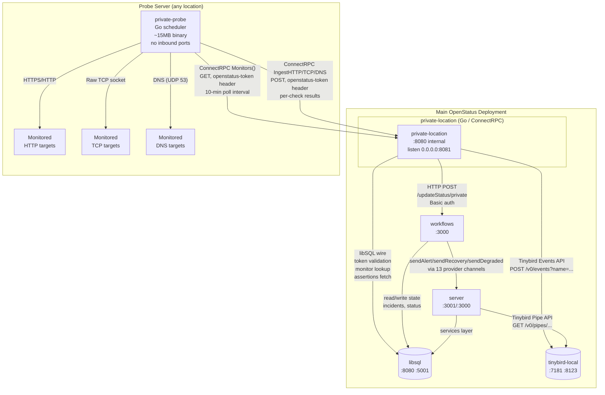
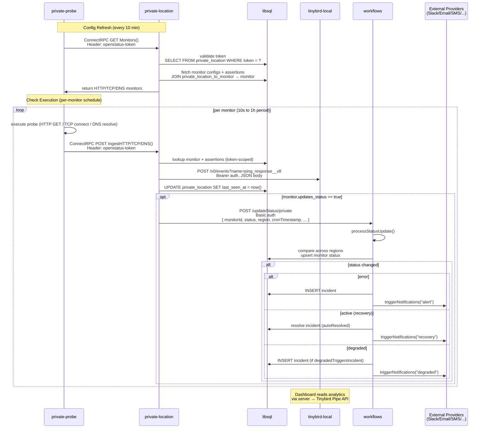

# Private Probe — Independent Deployment Guide

## Overview

The OpenStatus private probe system lets you run monitoring checks from your own
infrastructure (on-prem, private networks, separate datacenters). It consists of
two components with a clean separation of concerns:

| Component | Role | DB Access | Tinybird Access | Deployable Separately |
|---|---|---|---|---|
| **private-location** | ConnectRPC server — token validation, config delivery, result ingestion, analytics forwarding | ✅ libSQL | ✅ Tinybird | ❌ stays on main server |
| **private-probe** | Stateless agent — polls for monitor configs, runs checks locally, reports results | ❌ None | ❌ None | ✅ **Yes** |

**Key insight:** `private-location` is the server-side gateway — it handles all
database lookups, Tinybird writes, and workflows callbacks. The `private-probe`
is a thin agent that only needs two environment variables and outbound network
access.

---

## Protocol-Annotated Architecture



### RPC Endpoints (private-location)

| Endpoint | Method | Purpose | Auth |
|---|---|---|---|
| `/private_location.v1.PrivateLocationService/Monitors` | GET | Fetch monitor configs assigned to the location | `openstatus-token` header |
| `/private_location.v1.PrivateLocationService/IngestHTTP` | POST | Report HTTP check result | `openstatus-token` header |
| `/private_location.v1.PrivateLocationService/IngestTCP` | POST | Report TCP check result | `openstatus-token` header |
| `/private_location.v1.PrivateLocationService/IngestDNS` | POST | Report DNS check result | `openstatus-token` header |
| `/health` | GET | Health check (unauthenticated) | None |

---

## Complete Protocol Matrix

| From | To | Protocol | Port | Auth | Payload |
|---|---|---|---|---|---|
| **private-probe** | **private-location** | **ConnectRPC** (HTTP/1.1 or HTTP/2, Protobuf binary, `connect.WithHTTPGet()`) | 8080 → 8081 | `openstatus-token` header | Protobuf |
| private-probe | monitored HTTP targets | **HTTPS** / HTTP | 443 / 80 | per-monitor headers | HTTP request |
| private-probe | monitored TCP targets | **Raw TCP** socket | arbitrary | — | TCP connect |
| private-probe | monitored DNS targets | **DNS** protocol (UDP 53) | 53 | — | DNS query |
| private-location | libsql | **libSQL wire protocol** over HTTP (Turso) | 8080 | `DB_AUTH_TOKEN` query param | SQL over HTTP |
| private-location | Tinybird | **Tinybird Events API** — `POST /v0/events?name=<ds>` | 7181 | `Bearer <token>` | JSON |
| private-location | workflows | **HTTP/JSON** `POST /updateStatus/private` | 3000 | `Basic <cron_secret>` | JSON |
| workflows | libsql | **libSQL wire protocol** over HTTP | 8080 | `DATABASE_AUTH_TOKEN` | SQL over HTTP |
| workflows | checker (public) | **HTTP/JSON** `POST /checker/{http,tcp,dns}` | 8080 → 8082 | `Basic <cron_secret>` | JSON |
| workflows | notification providers | **HTTP/JSON** (webhooks) / **SMTP** / **API clients** | various | per-provider config | JSON / SMTP / SDK |
| checker (public) | Tinybird | **Tinybird Events API** — `POST /v0/events?name=<ds>` | 7181 | `Bearer <token>` | JSON |
| checker (public) | workflows | **HTTP/JSON** `POST /updateStatus` | 3000 | `Basic <cron_secret>` | JSON |
| server | libsql | **libSQL wire protocol** over HTTP | 8080 | `DATABASE_AUTH_TOKEN` | SQL over HTTP |
| server | Tinybird | **Tinybird Pipe API** — `GET /v0/pipes/<pipe>.json` | 7181 | `Bearer <token>` | JSON |
| dashboard / status-page | server | **tRPC** over HTTP | 3000 → 3001 | NextAuth session | JSON |
| dashboard / status-page | libsql | **libSQL wire protocol** over HTTP | 8080 | `DATABASE_AUTH_TOKEN` | SQL over HTTP |
| (internal) | Tinybird → ClickHouse | **ClickHouse Native** + **ClickHouse HTTP** | 9000 (internal), 8123 (exposed) | — | ClickHouse protocol |

> **Two separate Tinybird APIs are in play:**
> - **Events API** (`POST /v0/events?name=<datasource>`) — high-throughput write path, used by `checker` and `private-location` to ingest raw check results.
> - **Pipe API** (`GET /v0/pipes/<pipe>.json`) — read path, used by `server` and `dashboard` to query aggregated analytics.

---

## Data Flow



### Key details

1. **Token scoping:** `private-location` validates the `openstatus-token` header against the `private_location` table on every RPC call. All DB queries (monitor lookup, assertions fetch) are scoped to the token's assigned monitors — preventing cross-tenant data leaks.

2. **Tinybird ingestion:** `private-location` uses the Tinybird Events API write path (`POST /v0/events`). The Go constants map to datasource names:
   - `DatasourceHTTP` = `"ping_response__v8"` (HTTP)
   - `DatasourceTCP` = `"tcp_response__v0"` (TCP)
   - `DatasourceDNS` = `"dns_response__v0"` (DNS)

3. **Status update path:** When `monitor.updates_status == true`, `private-location` POSTs to workflows `/updateStatus/private`. Workflows then runs `processStatusUpdate` (majority-threshold logic), creates/resolves incidents, and dispatches notifications through the `triggerNotifications` → `providerToFunction` pipeline.

4. **Notifications:** Private-location-triggered status changes go through the same notification pipeline as public checker results. See `docs/notification-system-gaps.md` for known limitations (no persistent queue, dedup-before-send, no delivery status).

5. **Analytics reads:** The dashboard queries aggregated analytics via server → Tinybird Pipe API (GET endpoints), not the Events API write path.

---

## Implementation Plan

### Phase 1 — Main Server: Expose `private-location` (IPv4 + TLS)

#### 1a. Bind to all IPv4 interfaces

In `docker-compose.yaml` or `docker-compose.github-packages.yaml`:

```diff
  private-location:
-   ports:
-     - "127.0.0.1:8081:8080"
+   ports:
+     - "0.0.0.0:8081:8080"
```

Apply:

```bash
docker compose up -d private-location
```

#### 1b. Reverse proxy with HTTPS

**Caddy (simplest — auto-TLS, auto-renew):**

```
# Caddyfile
pl.yourdomain.com {
    reverse_proxy 127.0.0.1:8081
}
```

```bash
caddy run --config Caddyfile
```

**nginx (manual TLS certs):**

```nginx
# /etc/nginx/sites-enabled/private-location.conf
server {
    listen 0.0.0.0:443 ssl http2;
    server_name pl.yourdomain.com;

    ssl_certificate     /etc/letsencrypt/live/pl.yourdomain.com/fullchain.pem;
    ssl_certificate_key /etc/letsencrypt/live/pl.yourdomain.com/privkey.pem;

    location / {
        proxy_pass http://127.0.0.1:8081;
        proxy_set_header Host $host;
        proxy_set_header X-Forwarded-For $proxy_add_x_forwarded_for;
        proxy_set_header X-Forwarded-Proto $scheme;
        proxy_read_timeout 45s;
    }
}
```

```bash
certbot --nginx -d pl.yourdomain.com
nginx -s reload
```

#### 1c. Optional: IP allowlist at reverse proxy

```nginx
location / {
    allow <probe-server-public-ip>;
    deny all;
    proxy_pass http://127.0.0.1:8081;
    # ...
}
```

#### 1d. Verify connectivity

```bash
curl -s https://pl.yourdomain.com/health
# Expected: {"status":"ok"}
```

---

### Phase 2 — Dashboard: Create Private Location & Get Token

1. Open Dashboard → **Settings** → **Private Locations**
2. Click **Create Private Location**
3. Name: e.g. `datacenter-nyc`
4. Copy the generated token → `a206f294-d9eb-4c69-b6d0-5b14980ddaff`

The token is stored in the `private_location` table in libSQL. The `private-location`
service validates it on every RPC call by querying:

```sql
SELECT ... FROM private_location WHERE token = ?
```

---

### Phase 3 — Probe Server: Deploy `private-probe`

The probe server needs:
- **OS:** Any Linux (Alpine-based Docker image, ~15MB)
- **CPU/RAM:** Minimal (single Go binary, ~30MB RAM at runtime)
- **Network:** Outbound access to (a) `pl.yourdomain.com:443`, (b) monitored targets
- **Inbound ports:** None
- **Storage:** None (no volumes, no persistent state)

#### Option A: Build from source

```yaml
# docker-compose.probe.yaml
services:
  private-probe:
    container_name: openstatus-private-probe
    build:
      context: ./apps/checker
      dockerfile: Dockerfile.probe
    environment:
      - OPENSTATUS_KEY=a206f294-d9eb-4c69-b6d0-5b14980ddaff
      - OPENSTATUS_INGEST_URL=https://pl.yourdomain.com
      - LOG_LEVEL=info
    restart: unless-stopped
    network_mode: host
    logging:
      driver: json-file
      options:
        max-size: "10m"
        max-file: "3"
```

#### Option B: Pre-built GHCR image + probe entrypoint

```yaml
# docker-compose.probe.yaml
services:
  private-probe:
    image: ghcr.io/openstatushq/openstatus-checker:latest
    container_name: openstatus-private-probe
    entrypoint: ["/opt/bin/probe"]
    environment:
      - OPENSTATUS_KEY=a206f294-d9eb-4c69-b6d0-5b14980ddaff
      - OPENSTATUS_INGEST_URL=https://pl.yourdomain.com
      - LOG_LEVEL=info
    restart: unless-stopped
    network_mode: host
    logging:
      driver: json-file
      options:
        max-size: "10m"
        max-file: "3"
```

> **Why `network_mode: host`?** The probe runs checks against local/private targets.
> Host networking ensures accurate source IP and avoids Docker NAT overhead for
> high-frequency TCP/DNS checks. Remove if not needed.

#### Option C: Bare-metal binary (no Docker)

```bash
# On a dev machine with Go 1.25+ and the repo cloned:
cd apps/checker
CGO_ENABLED=0 GOOS=linux GOARCH=amd64 \
  go build -trimpath -ldflags "-s -w" -o probe ./cmd/private/main.go

# Copy the ~12MB probe binary to the target server, then:
OPENSTATUS_KEY=a206f294-d9eb-4c69-b6d0-5b14980ddaff \
OPENSTATUS_INGEST_URL=https://pl.yourdomain.com \
LOG_LEVEL=info \
./probe
```

#### Verify startup

```bash
docker compose -f docker-compose.probe.yaml up -d
docker logs -f openstatus-private-probe
```

Expected output:

```
starting openstatus private location probe
  ingest_url=https://pl.yourdomain.com
  has_key=true
  log_level=info
  config_refresh_interval=10m0s
fetching initial monitor configuration
```

If no monitors are assigned yet, it will log:

```
Started 0 monitoring jobs (0 HTTP, 0 TCP, 0 DNS)
```

If there's a token/auth issue:

```
Failed to fetch monitors: unauthenticated: missing token
```

---

### Phase 4 — Dashboard: Assign Monitors

1. Create or edit a monitor in the dashboard
2. Under **Regions**, select your private location (`datacenter-nyc`)
3. The monitor appears in the probe's next config poll (within 10 minutes)
4. Verify the probe picks it up:

```
Started monitoring job for 42 (https://my-internal-api.internal)
Monitor check succeeded for 42 (https://my-internal-api.internal), ingest response: ...
```

5. Check results appear in the dashboard under the monitor's analytics

---

### Phase 5 — Verification Checklist

| # | Check | Command / Location |
|---|---|---|
| 1 | `private-location` bound to `0.0.0.0:8081` | `docker compose ps private-location` → ports `0.0.0.0:8081->8080/tcp` |
| 2 | Reverse proxy responds with 200 | `curl -s https://pl.yourdomain.com/health` → `{"status":"ok"}` |
| 3 | Probe container running | `docker compose -f docker-compose.probe.yaml ps` → `Up (healthy)` |
| 4 | Probe fetches monitors | `docker logs openstatus-private-probe \| grep "Started monitoring"` |
| 5 | Check results ingested | Dashboard → monitor detail → recent checks visible |
| 6 | Status updates working | Dashboard → monitor → status reflects real state |
| 7 | Notifications fire on status change | Verify notification channel receives alert/recovery/degraded |
| 8 | `private-location` logs clean | `docker logs openstatus-private-location \| grep -i error` → no errors |

---

## Environment Variable Reference

### Probe Server

| Variable | Required | Default | Description |
|---|---|---|---|
| `OPENSTATUS_KEY` | **Yes** | — | Token from dashboard private location |
| `OPENSTATUS_INGEST_URL` | **Yes** | `https://openstatus-private-location.fly.dev` | Base URL of private-location ConnectRPC server |
| `LOG_LEVEL` | No | `info` | `debug` / `info` / `warn` / `error` |

### Main Server (`private-location`)

| Variable | Required | Default | Description |
|---|---|---|---|
| `DB_URL` | **Yes** | — | libSQL endpoint, e.g. `http://libsql:8080` |
| `DB_AUTH_TOKEN` | No | `""` | libSQL auth token (empty for local) |
| `TINYBIRD_TOKEN` | **Yes** | — | Tinybird admin token for event ingestion |
| `TINYBIRD_URL` | **Yes** | — | Tinybird API base, e.g. `http://tinybird-local:7181` |
| `OPENSTATUS_WORKFLOWS_URL` | **Yes** | — | Workflows URL, e.g. `http://workflows:3000` |
| `CRON_SECRET` | **Yes** | — | Shared secret for Basic auth to workflows |
| `PORT` | No | `8080` | Internal listen port |
| `GIN_MODE` | No | `release` | Set to `release` for production |

---

## Network Requirements Summary

### Probe Server → Outbound

| Destination | Protocol | Port | Purpose |
|---|---|---|---|
| `pl.yourdomain.com` | HTTPS | 443 | ConnectRPC to private-location |
| Monitored HTTP targets | HTTPS / HTTP | 443 / 80 | HTTP checks |
| Monitored TCP targets | Raw TCP | arbitrary | TCP checks |
| DNS resolvers | DNS (UDP) | 53 | DNS checks and name resolution |

### Main Server → Inbound

| Source | Protocol | Port | Purpose |
|---|---|---|---|
| Probe server public IP | HTTPS | 443 | ConnectRPC from private-probe (via reverse proxy) |

### Probe Server → Inbound

**None.** The probe only initiates outbound connections.

---

## Troubleshooting

### Probe logs: `unauthenticated: missing token`

**Cause:** `OPENSTATUS_KEY` is empty or not set.

**Fix:** Set `OPENSTATUS_KEY` to the token from Dashboard → Private Locations. Restart probe.

### Probe logs: `Failed to fetch monitors: ...`

**Cause:** Token is invalid, or `private-location` is unreachable.

**Fix:**
1. Verify token in Dashboard → Private Locations
2. Verify connectivity: `curl https://pl.yourdomain.com/health` from the probe server
3. Check `private-location` logs: `docker logs openstatus-private-location`

### Probe fetches monitors but checks don't appear in dashboard

**Cause:** Tinybird is not receiving events, or datasource names don't match.

**Check:**
1. `private-location` logs for Tinybird errors
2. Verify Tinybird datasources exist: the `ping_response__v8`, `tcp_response__v0`, `dns_response__v0` datasources must be deployed via `scripts/tinybird-self-hosted-init.sh`
3. Verify `TINYBIRD_TOKEN` is set and valid

### DNS/TCP monitors show no data

See [self-hosted-docker-architecture.md](self-hosted-docker-architecture.md#dnstcp-monitors-show-no-data-in-dashboard) for common causes (missing required columns, wrong datasource names, requestStatus enum mismatch).

### Notifications not firing for private-location monitors

**Cause:** `monitor.updates_status` is `false`, or workflows can't be reached.

**Check:**
1. Verify the monitor has `updates_status` enabled (dashboard → monitor settings)
2. Check `private-location` logs for workflow POST errors
3. Verify `OPENSTATUS_WORKFLOWS_URL` and `CRON_SECRET` are set correctly
4. Check workflows logs for `/updateStatus/private` requests and `triggerNotifications` output
5. See `docs/notification-system-gaps.md` for known notification reliability limitations

### Probe can't reach monitored internal targets

**Cause:** Docker bridge networking isolates the container from internal networks.

**Fix:** Use `network_mode: host` in the probe's Docker Compose file so it shares the host's network stack and can reach internal IPs.

---

## Security Considerations

1. **TLS is mandatory.** The `openstatus-token` header is plaintext. Without HTTPS, it is trivially sniffable.
2. **IP allowlisting** at the reverse proxy adds defense-in-depth. Only your probe server's IP should reach `private-location`.
3. **Token rotation:** Generate a new token in the dashboard and update the probe's `OPENSTATUS_KEY` to rotate credentials.
4. **The probe binary itself has no secrets on disk** — it only holds the token in memory via environment variables.
5. **Private-location scopes all DB queries by token.** A compromised token only exposes monitors assigned to that private location, not all monitors in the workspace.

---

## Scaling

- **Multiple probes per location:** Deploying multiple `private-probe` containers with the same `OPENSTATUS_KEY` spreads monitor checks across instances via the scheduler's `RunSingleInstance: true` flag.
- **Multiple locations:** Create separate private locations in the dashboard (each gets its own token) and deploy probes in each target network.
- **Resource limits:** A single probe handles hundreds of monitors comfortably. The Go binary uses ~30MB RAM. The `tasks` scheduler library is concurrency-safe.

---

## Related Documentation

- [Self-Hosted Docker Architecture](self-hosted-docker-architecture.md) — full service topology, startup order, network config
- [Notification System Gaps](notification-system-gaps.md) — known limitations in notification delivery reliability
- [Architecture Overview](architecture.md) — cloud deployment, CI/CD, package inventory
