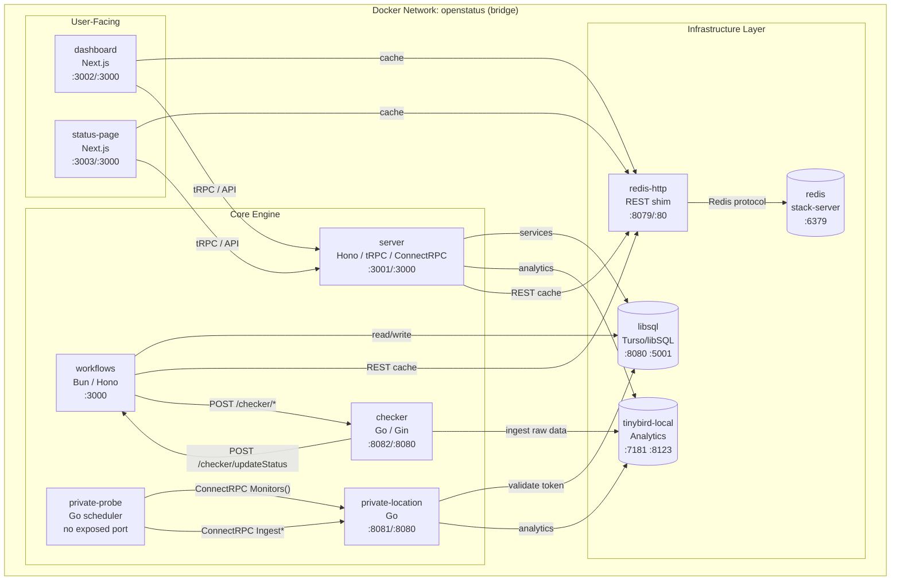
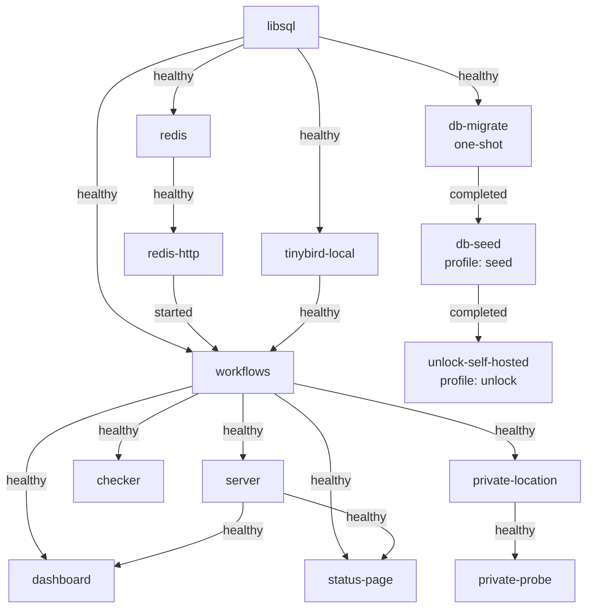
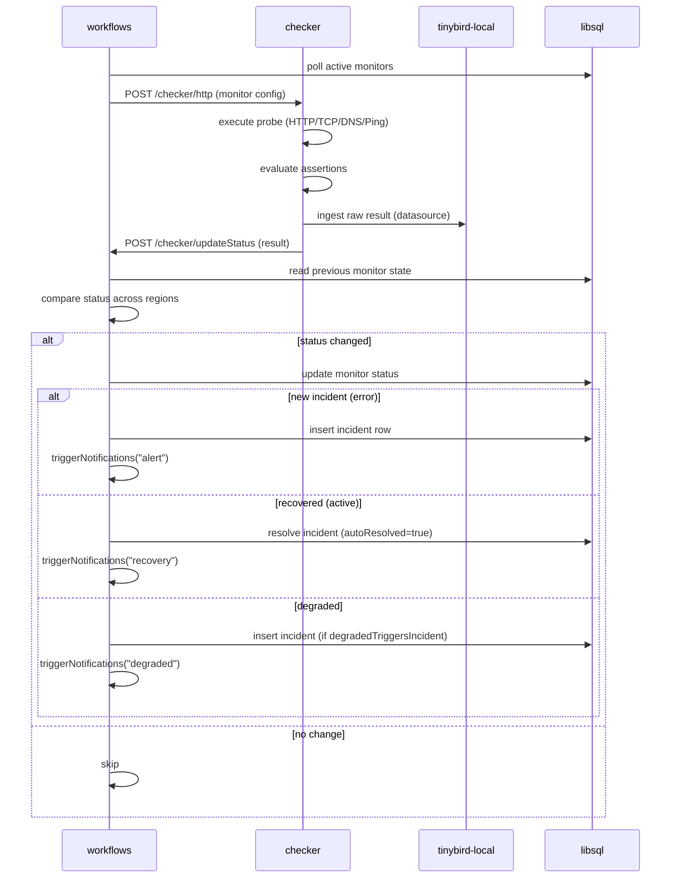
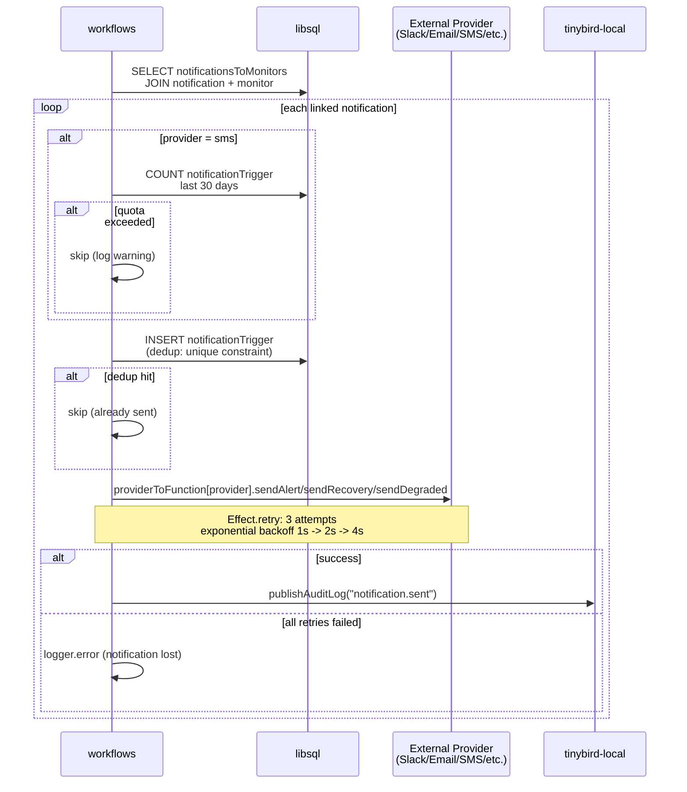
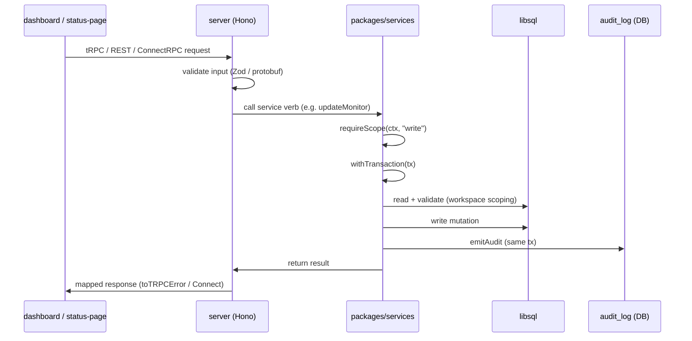
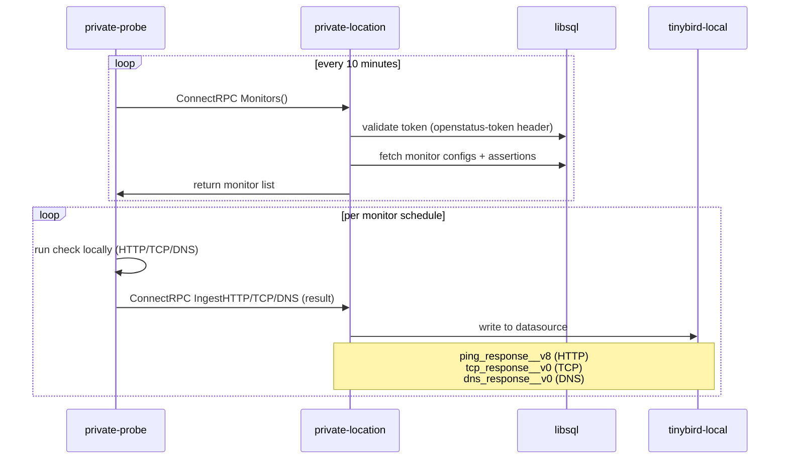
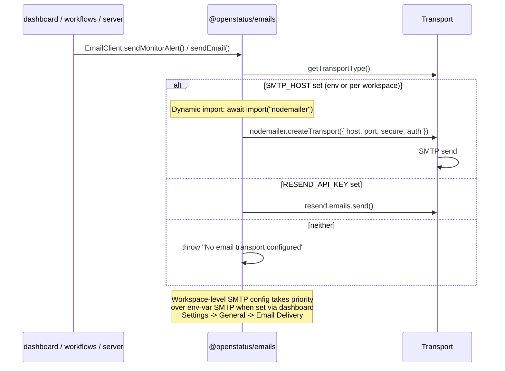
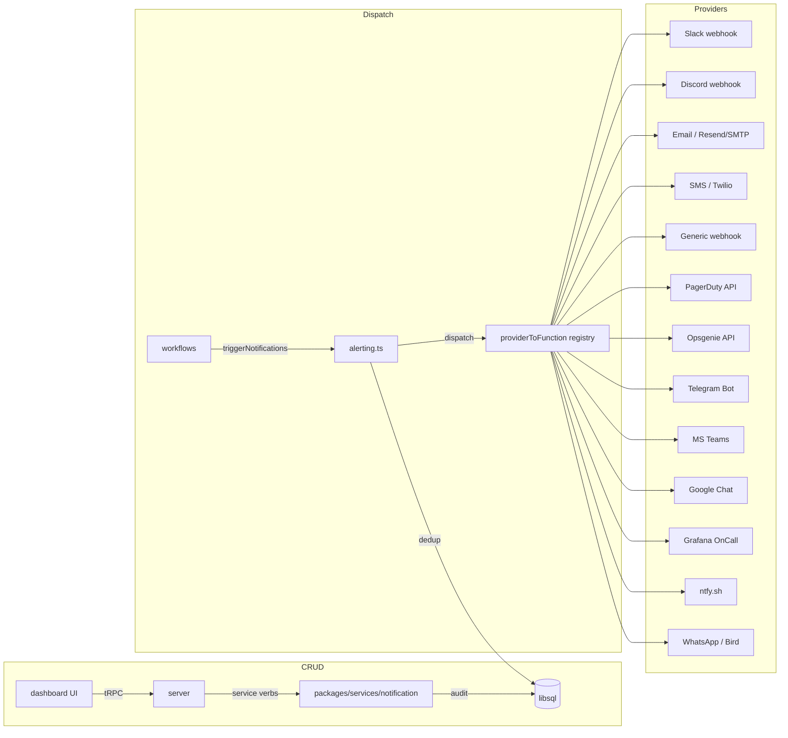

# Self-Hosted Docker Architecture

> **Status:** Applied to `main` branch as of 2026-07-09.
> Incorporates changes from PR [#2083](https://github.com/openstatusHQ/openstatus/pull/2083) and subsequent architecture refinements.

## Service Topology



### Port Map

| Service | Internal | External | Protocol |
|---------|----------|----------|----------|
| libsql | 8080, 5001 | 8080, 5001 | SQL |
| tinybird-local | 7181, 8123 | 7181, 8123 | HTTP |
| redis | 6379 | 6379 | Redis |
| redis-http | 80 | 8079 | HTTP (Upstash REST) |
| workflows | 3000 | 3000 | HTTP |
| server | 3000 | 3001 | HTTP |
| checker | 8080 | 8082 | HTTP (Gin) |
| private-location | 8080 | 8081 | HTTP (ConnectRPC) |
| private-probe | — | — | — |
| dashboard | 3000 | 3002 | HTTP |
| status-page | 3000 | 3003 | HTTP |

## Startup Dependency Order



## Data Traffic Flow

### Monitoring Check Lifecycle (self-hosted)



### Notification Dispatch Flow (self-hosted)



### API Request Flow (self-hosted)



### Private Location Flow (self-hosted)



### Email Delivery Flow (self-hosted)



## Service Details

### Infrastructure Layer

| Service | Image | Health Check | Purpose |
|---------|-------|-------------|---------|
| `libsql` | `ghcr.io/tursodatabase/libsql-server:latest` | TCP :8080 | Primary transactional DB (Drizzle ORM) |
| `tinybird-local` | `tinybirdco/tinybird-local:latest` | `curl :7181/` | Local analytics engine. `COMPATIBILITY_MODE=1`. amd64 only. |
| `redis` | `redis/redis-stack-server:6.2.6-v6` | TCP :6379 | Caching + rate limiting |
| `redis-http` | `hiett/serverless-redis-http:latest` | HTTP :80 | REST-to-Redis shim (mimics Upstash REST API) |
| `db-migrate` † | `oven/bun:1.3.6` | One-shot | Runs `drizzle-kit migrate` |
| `db-seed` † | `oven/bun:1.3.6` | One-shot | Seeds initial workspace, monitors, status pages |
| `unlock-self-hosted` † | `oven/bun:1.3.6` | One-shot | Sets plan=scale + max limits on all workspaces |

† Profile-gated one-shot services.

### Core Engine Layer

| Service | Health Check | Startup Deps | Purpose |
|---------|--------------|--------------|---------|
| `workflows` | `curl :3000/ping` | libsql + redis-http + tinybird | Cron orchestrator: polls DB, dispatches checks, processes results, creates incidents, sends notifications |
| `server` | `curl :3000/ping` | workflows + libsql | Backend API: REST v1, tRPC, ConnectRPC v2, Slack bot, MCP |
| `checker` | `curl :8080/health` | server | HTTP/TCP/DNS/Ping probe executor. Self-hosted single-region equivalent of cloud's 21-region fleet |
| `private-location` | `curl :8080/health` | server | On-prem probe gateway. Serves monitor configs to private-probe, ingests results |
| `private-probe` | — | private-location | On-prem scheduler. Polls private-location every 10min for configs, runs checks locally, reports results |

### User-Facing Layer

| Service | Health Check | Startup Deps | Purpose |
|---------|--------------|--------------|---------|
| `dashboard` | `curl :3000/` | workflows + libsql + server | Admin UI. Monitor management, notification config, status pages, team, billing. `AUTH_TRUST_HOST=true` |
| `status-page` | `curl :3000/` | workflows + libsql + server | Public status pages. Uptime bars, incident timelines, subscription forms |

### Network Configuration

All services communicate over `openstatus` bridge network:

```
DATABASE_URL=http://libsql:8080              ← all TypeScript services
DB_URL=http://libsql:8080                    ← Go services
TINYBIRD_URL=http://tinybird-local:7181      ← analytics consumers
TINYBIRD_TOKEN=<from init script>            ← event ingestion
CHECKER_URL=http://checker:8080              ← workflows → checker dispatch
OPENSTATUS_WORKFLOWS_URL=http://workflows:3000  ← checker → workflows callback
```

## Notification System in Self-Hosted

### Architecture



### Dispatch details

1. **Status change detected** in `processStatusUpdate` (workflows)
2. **`triggerNotifications`** joins `notificationsToMonitors` → `notification` → `monitor`
3. **SMS quota check**: counts `notificationTrigger` rows in last 30 days vs `workspace.limits["sms-limit"]`
4. **Dedup**: inserts `notificationTrigger` row — `unique(notificationId, monitorId, cronTimestamp)`
5. **Send**: `providerToFunction[provider].sendAlert/sendRecovery/sendDegraded`
6. **Retry**: `Effect.retry` — 3 attempts, exponential backoff (1s → 2s → 4s)
7. **Audit**: `notification.sent` event published to Tinybird (best-effort)

### Known gaps (see `docs/notification-system-gaps.md`)

- ❌ No persistent queue — in-process retry only, permanent loss after 3 failures
- ❌ Dedup inserted before send — blocks re-delivery on failure
- ❌ No delivery status column on `notificationTrigger`
- ❌ No dashboard history of sent notifications
- ❌ `notification.sent` audit is Tinybird-only, best-effort, no status field

## Checker vs Private-Probe vs Private-Location

These three Go services serve different roles:

| | checker | private-probe | private-location |
|---|---|---|---|
| **Entrypoint** | `cmd/server/main.go` | `cmd/private/main.go` | `cmd/server/main.go` |
| **Module** | `apps/checker` | `apps/checker` | `apps/private-location` |
| **Protocol** | REST (Gin) | ConnectRPC (client) | ConnectRPC (server) |
| **Lifecycle** | HTTP listener | Scheduler loop | HTTP listener |
| **Auth** | `CRON_SECRET` (Basic) | `OPENSTATUS_KEY` (token header) | Validates `openstatus-token` against DB |
| **Receives from** | workflows (POST /checker/*) | private-location (Monitors RPC) | private-probe (Monitors/Ingest RPCs) |
| **Reports to** | workflows (/checker/updateStatus) | private-location (IngestHTTP/TCP/DNS RPCs) | Tinybird |
| **DB access** | Indirect (via workflows) | None | Direct libsql |
| **Monitor types** | HTTP, TCP | HTTP, TCP, DNS | HTTP, TCP, DNS |
| **Docker image** | `openstatus/checker` | `openstatus/private-probe` | `openstatus/private-location` |
| **Dockerfile** | `apps/checker/Dockerfile` | `apps/checker/Dockerfile.probe` | `apps/private-location/Dockerfile` |

### Tinybird Datasource Mapping

| Go constant | Tinybird datasource | Monitor type |
|---|---|---|
| `DatasourceHTTP` = `"ping_response__v8"` | `ping_response__v8` | HTTP |
| `DatasourceTCP` = `"tcp_response__v0"` | `tcp_response__v0` | TCP |
| `DatasourceDNS` = `"dns_response__v0"` | `dns_response__v0` | DNS |

If these names don't match the datasources deployed by the init script, events will be
quarantined or sent to the wrong table.

## Self-Host Routing (PR #2083 Applied)

In cloud mode, the checker fleet is a set of ~21 Fly.io regions with GCP Cloud Tasks dispatching work. In self-host mode, these are replaced with direct HTTP calls between Docker containers.

### Decision Logic

The system determines self-host mode via `packages/utils/src/self-host.ts`:

```ts
export function isSelfHost(): boolean {
  if (process.env.SELF_HOST === "true") return true;
  return !hasGCPConfig({ ... });
}

export function getCheckerUrl(env: { CHECKER_URL?: string }): string {
  return env.CHECKER_URL || "http://localhost:8080";
}

export function getCheckerRegion(region: string): string {
  if (!isSelfHost()) return region;
  return process.env.CHECKER_REGION || "ams";
}
```

### Affected Files

| File | Behavior in Self-Host |
|------|----------------------|
| `apps/server/src/libs/checker/utils.ts` | `getCheckerUrl()` → `http://checker:8080` |
| `apps/server/src/routes/v1/check/http/post.ts` | Ping endpoints → local checker, drops `fly-prefer-region` |
| `packages/api/src/router/checker.ts` | `testHttp` / `testTcp` / `testDns` / `triggerChecker` / `generateUrl` all route to local checker |
| `apps/workflows/src/cron/checker.ts` | `sendCheckerTasks()` → `sendCheckerTasksDirect()` when no GCP creds |
| `apps/workflows/src/cron/monitor.ts` | `LaunchMonitorWorkflow()` skips if no GCP creds |
| `apps/checker/checker/update.go` | `UpdateStatus()` → direct HTTP POST to workflows when no GCP creds |

## Redis Infrastructure

Self-hosted deployments need Redis for rate limiting, caching, and session management.

### Why Two Containers

The codebase uses `@openstatus/upstash` which speaks the **Upstash REST API** (HTTP-based), not raw Redis protocol. A REST-to-Redis shim (`serverless-redis-http`) is required.

```
Node.js services (workflows, server, dashboard, status-page)
       │ HTTP (Upstash REST API)
       ▼
redis-http (hiett/serverless-redis-http:latest)
  SRH_MODE=env
  SRH_CONNECTION_STRING=redis://redis:6379
       │ Redis protocol
       ▼
redis (redis/redis-stack-server:6.2.6-v6)
```

### Wired Services

All four Node.js services get runtime overrides:

```yaml
environment:
  - UPSTASH_REDIS_REST_URL=http://redis-http:80
  - UPSTASH_REDIS_REST_TOKEN=${UPSTASH_REDIS_REST_TOKEN:-replace-with-a-long-random-secret}
```

## Email Architecture (Self-Hosted)

`@openstatus/emails` supports dual transport. Self-hosted deployments can use either:

| Transport | Activation | Dependency | Runtime |
|-----------|-----------|------------|--------|
| **Resend** | `RESEND_API_KEY` is set | `resend` (HTTP API) | Edge-safe |
| **SMTP** | `SMTP_HOST` is set (env or per-workspace) | `nodemailer` (Node.js) | Node.js only |

SMTP takes precedence when both are configured. Per-workspace SMTP (set via **Dashboard → Settings → General → Email Delivery**) takes priority over environment variables.

### Edge Runtime Safety

`nodemailer` is **dynamically imported** in `packages/emails/src/send.ts` so the Next.js Edge Runtime bundler never statically resolves it:

```ts
import type { Transporter } from "nodemailer"; // type-only — erased at compile time

async function getSmtpTransport(): Promise<Transporter> {
  const { createTransport } = await import("nodemailer"); // dynamic — bundler barrier
  return createTransport({ host, port, secure, auth });
}
```

This means dashboard and status-page Edge routes (`/api/onboarding/checks`, `/api/trpc/edge/[trpc]`) that transitively import `@openstatus/emails` won't fail with `stream` module errors.

## Custom Domains in Self-Hosted Mode

In cloud deployments, custom domains are registered with Vercel's domain API with DNS verification. In self-hosted mode, Vercel is not involved — domain registration and verification are skipped entirely.

### Creation-time hosting mode

Status pages can be created in one of two modes:

- **Subdomain** (default): `{slug}.openstatus.dev` — requires a unique slug.
- **Custom Domain**: User enters e.g. `status.company.com`. An editable "Identifier" field lets the user override the internal slug. The `selfHosted` column on the `page` table is set to `true`, and `customDomain` is set immediately.

### Identifier field (custom domain mode)

The **Identifier** is the internal slug used for database lookups. Defaults to the domain with dots replaced by hyphens (`status.company.com` → `status-company-com`). The user may customize it.

Slug resolution priority: user-provided → auto-derived from domain → random `page-xxxx` fallback. On collision, a random 4-char suffix is appended.

### How it works

1. **Dashboard:** Custom domain form accepts any valid domain. "Refresh Configuration" button and 30-second polling are hidden.
2. **API layer (`packages/api/src/router/page.ts`):** `addDomainToVercel` / `removeDomainFromVercel` gated behind `!isSelfHost()`.
3. **Domain router (`packages/api/src/router/domain.ts`):** All three Vercel verification queries return synthetic `{ verified: true }` when `isSelfHost()` is true.
4. **UI (`domain-configuration.tsx`):** When status is `"Verification Skipped"`, DNS steps replaced with confirmation card.

### Reverse Proxy Configuration

Custom domains are resolved via the `Host` header (`apps/status-page/src/lib/domain.ts`). Configure your reverse proxy to route traffic to the `status-page` container (port 3003):

```nginx
server {
    listen 80;
    server_name status.yourdomain.com;
    location / {
        proxy_pass http://localhost:3003;
        proxy_set_header Host $host;
        proxy_set_header X-Forwarded-Host $host;
    }
}
```

### Affected source files

| File | Change |
|------|--------|
| `packages/db/src/schema/pages/page.ts` | Added `self_hosted` boolean column (default `false`) |
| `packages/db/src/schema/pages/validation.ts` | `customDomainSchema` regex relaxed for localhost-family domains |
| `packages/services/src/page/create.ts` | `newPage()` auto-generates slug from domain when `selfHosted` |
| `packages/services/src/page/schemas.ts` | `NewPageInput` accepts optional `selfHosted` + `customDomain` |
| `packages/api/src/router/page.ts` | Vercel domain calls gated behind `!isSelfHost()` |
| `packages/api/src/router/domain.ts` | Synthetic `verified: true` responses in self-hosted mode |
| `apps/dashboard/src/components/domains/domain-configuration.tsx` | "Verification skipped" card |
| `apps/dashboard/src/components/domains/use-domain-status.ts` | Self-hosted response → `"Verification Skipped"` status |
| `apps/dashboard/src/components/domains/domain-status-icon.tsx` | Chevron-right icon for skipped status |
| `apps/dashboard/src/components/forms/status-page/form-custom-domain.tsx` | Hides refresh button + polling |
| `apps/dashboard/src/components/forms/status-page/form-general.tsx` | Radio toggle (Subdomain / Custom Domain) |
| `apps/dashboard/src/components/forms/onboarding/create-page.tsx` | Same toggle in onboarding |
| `apps/dashboard/src/app/onboarding/_steps/step-2.tsx` | Updated locked summary for custom-domain pages |
| `apps/dashboard/src/app/onboarding/client.tsx` | Passes `selfHosted` + `customDomain` through mutation |
| `apps/dashboard/src/app/(dashboard)/status-pages/create/client.tsx` | Passes `selfHosted` + `customDomain` through mutation |

## Environment Variables

### docker-compose.yaml Interpolation

Docker Compose resolves `${VAR}` from shell env or `.env` file. A `.env → .env.docker` symlink is created so compose reads the same file for both interpolation (compose-time) and container env (runtime via `env_file`).

### Self-Host Specific Vars

| Variable | Default | Used By | Purpose |
|----------|---------|---------|---------|
| `SELF_HOST` | `"true"` | dashboard, status-page, workflows | Enables magic-link auth, self-host routing |
| `CHECKER_URL` | `http://checker:8080` | workflows, server, dashboard, status-page | Where to dispatch checker tasks |
| `CHECKER_REGION` | `"self-hosted"` | workflows, server | Region identifier for self-hosted checker (defaults to `"ams"` if unset) |
| `OPENSTATUS_WORKFLOWS_URL` | `http://workflows:3000` | checker, server, private-location | Workflows callback URL |
| `OPENSTATUS_INGEST_URL` | (cloud default) | private-probe | Private-location service URL |
| `PRIVATE_LOCATION_TOKEN` | (empty) | private-probe | Auth token for private-location |
| `UPSTASH_REDIS_REST_URL` | `http://redis-http:80` | workflows, server, dashboard, status-page | Redis REST shim |
| `UPSTASH_REDIS_REST_TOKEN` | `replace-with-a-long-random-secret` | workflows, server, dashboard, status-page | Redis auth token |
| `TINYBIRD_TOKEN` | (from init script) | checker, private-location | Tinybird admin token for event ingestion |
| `TINYBIRD_URL` | `http://tinybird-local:7181` | checker, private-location, server, dashboard, status-page | Tinybird API base URL |
| `TINY_BIRD_API_KEY` | (same as TINYBIRD_TOKEN) | server, dashboard, status-page | Tinybird token for pipe endpoint queries |

### Volume Persistence

| Volume | Mount | Service |
|--------|-------|---------|
| `libsql-data` | `/var/lib/sqld` | libsql |
| `redis-data` | `/data` | redis |
| `workflows-data` | `/app/data` | workflows |
| `tinybird-data` | `/var/lib/clickhouse` | tinybird-local |

## Docker Build Matrix

| Image | Context | Dockerfile | Runtime |
|-------|---------|------------|---------|
| `openstatus/checker` | `apps/checker` | `Dockerfile` | `alpine:3.21` |
| `openstatus/private-probe` | `apps/checker` | `Dockerfile.probe` | `alpine:3.21` |
| `openstatus/workflows` | `.` | `apps/workflows/Dockerfile` | `debian:bullseye-slim` |
| `openstatus/server` | `.` | `apps/server/Dockerfile` | `debian:bullseye-slim` |
| `openstatus/dashboard` | `.` | `apps/dashboard/Dockerfile` | `debian:bullseye-slim` |
| `openstatus/status-page` | `.` | `apps/status-page/Dockerfile` | `debian:bullseye-slim` |
| `openstatus/private-location` | `apps/private-location` | `Dockerfile` | `alpine:3.21` |

## PR #2083 Application Summary

The original PR was **not merged**, but equivalent or adapted changes were applied:

| PR Change | Status | Adaptation |
|-----------|--------|------------|
| `isSelfHost()`, `getCheckerUrl()`, `getCheckerRegion()` in `packages/utils` | ✅ Applied | Added to `packages/utils/src/self-host.ts` |
| Self-host routing in `apps/server/src/libs/checker/utils.ts` | ✅ Applied | Uses `isSelfHost()` + `getCheckerUrl()` |
| Self-host routing in `apps/server/src/routes/v1/check/http/post.ts` | ✅ Applied | Conditional URL + drops `fly-prefer-region` |
| Self-host routing in `packages/api/src/router/checker.ts` | ✅ Applied | All 5 functions (testHttp, testTcp, testDns, triggerChecker, generateUrl) |
| Lazy GCP client + self-host guard in `apps/workflows/src/cron/monitor.ts` | ✅ Applied | `hasGCPConfig()` guard, lazy `CloudTasksClient` init |
| Self-host dispatch in `apps/workflows/src/cron/checker.ts` | ⚠️ Pre-existing | Already had `sendCheckerTasksDirect()` with Effect-based retry |
| Go direct HTTP in `apps/checker/checker/update.go` | ⚠️ Pre-existing | Already had `hasGCPConfig()` + direct HTTP path |
| `SELF_HOST` in `apps/workflows/src/env.ts` | ✅ Applied | Added |
| Redis + redis-http in `docker-compose.yaml` | ✅ Applied | Added both services + wired env vars |
| Checker + private-probe in `docker-compose.yaml` | ✅ Applied | Added both services |
| `PRIVATE_LOCATION_TOKEN` in `.env.docker.example` + `.env.docker` | ✅ Applied | Added placeholder |
| `.env` symlink to `.env.docker` | ✅ Applied | Eliminates compose interpolation warnings |

## Self-Hosted Feature Limits

By default, seeded workspaces use plan-level limits. The `unlock-self-hosted` profile updates every workspace to the "scale" plan and sets permissive limits (9999 monitors, all regions, all notification providers, all add-on features enabled).

```bash
# After seeding, unlock all features:
docker compose --profile unlock run unlock-self-hosted
```

| Service | Profile | Purpose |
|---------|---------|---------|
| `db-seed` | `seed` | Populate initial workspace, monitors, status pages, notifications |
| `unlock-self-hosted` | `unlock` | Set plan=scale and max limits on all workspaces |

## Troubleshooting

### DNS/TCP monitors show no data in dashboard

**Symptom:** Private-probe logs show successful checks, but dashboard logs page is empty or shows errors.

**Common causes:**

1. **Missing required columns** — The `dns_response__v0` datasource has required (non-nullable)
   columns including `assertions` and `resolver`. If the private-location's ingest handler
   omits either field, every event is silently dropped. Verify row count:
   ```sh
   docker compose exec tinybird-local clickhouse-client --query "SELECT count() FROM d_22d932.dns_response__v0"
   ```

2. **Wrong datasource name** — The Go constant must match the Tinybird datasource name exactly.

3. **requestStatus enum mismatch** — The probe must send `"success"` (not `"active"`) as the
   default request status. The dashboard SDK validates against `["error", "success", "degraded"]`.

4. **Tinybird project not deployed** — The `tinybird-local` container starts empty. Run
   `./scripts/tinybird-self-hosted-init.sh` to deploy pipes, datasources, and endpoints.

5. **Dashboard not restarted after Tinybird deploy** — Restart: `docker compose restart dashboard server status-page`

### Monitor ID mismatch in IngestDNS/IngestTCP

**Symptom:** `"sql: no rows in result set"` error with `error.type=monitor_lookup`.

**Cause:** The handler passed `req.Msg.Id` (check-run UUID) instead of `req.Msg.MonitorId` (the numeric monitor ID) to the database lookup query.

### Tinybird endpoint push fails

**Symptom:** `tb push endpoints/` fails with `"Invalid results"`.

**Cause:** Pipe checker tests run against empty datasources. Use `--no-check`:
```sh
TB_VERSION_WARNING=0 tb push endpoints/ --force --yes --no-check
```

### Migration troubleshooting

**Symptom:** `SQLite error: table page has no column named self_hosted` despite `db-migrate` logging success.

**Fix:** Apply the migration SQL directly via the libsql HTTP API:

```sh
curl -s -X POST "http://localhost:8080/v2/pipeline" \
  -H "Content-Type: application/json" \
  -d '{"requests":[{"type":"execute","stmt":{"sql":"ALTER TABLE page ADD self_hosted integer DEFAULT false NOT NULL"}}]}'
```

To reset migration tracking entirely:

```sh
docker compose down -v   # removes volumes including libsql-data
docker compose up -d     # recreates everything, migrations rerun cleanly
```

## Verification

```bash
# Start all services (runtime + one-shot via profiles)
docker compose up -d

# Check status — all should be healthy
docker compose ps

# Verify migration applied (self_hosted column exists)
curl -s -X POST "http://localhost:8080/v2/pipeline" \
  -H "Content-Type: application/json" \
  -d '{"requests":[{"type":"execute","stmt":{"sql":"PRAGMA table_info(page)"}}]}' \
  | python3 -c "import json,sys; r=json.load(sys.stdin); cols=[row[1] for row in r['results'][0]['response']['result']['rows']]; print('OK' if 'self_hosted' in cols else 'MIGRATION MISSING')"

# Seed the database
docker compose --profile seed run db-seed

# Unlock all features for self-hosted
docker compose --profile unlock run unlock-self-hosted

# Access services
open http://localhost:3002   # Dashboard
open http://localhost:3003   # Status Page

# Check probe logs (expected to show "unauthenticated" until token set)
docker logs openstatus-private-probe
```
